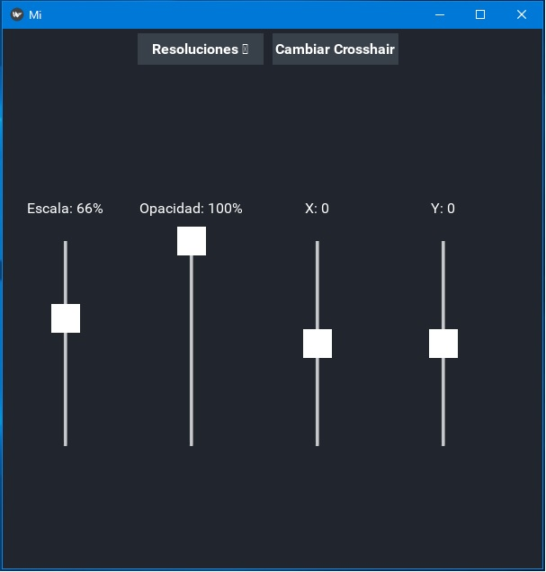
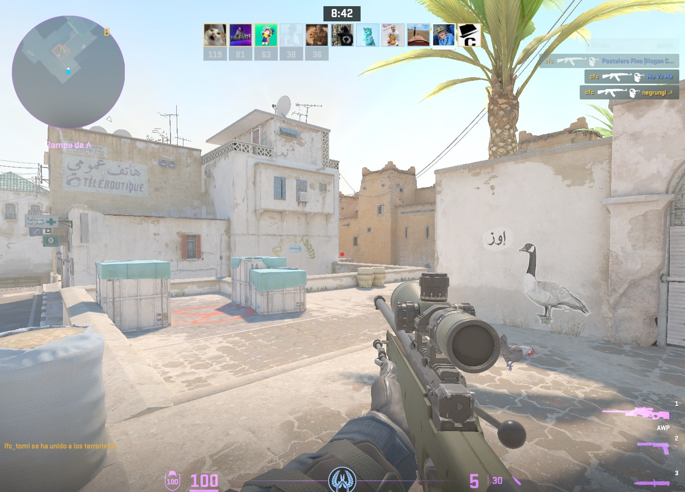

Una herramienta visual para superponer un **crosshair personalizable** en pantalla, ideal si tu monitor no tiene esta funcion y tu placa de video no es compatible con la misma. 

Utiliza **Kivy** para la interfaz de usuario y **PyQt5** para mostrar la imagen flotante centrada en pantalla.

Recomendacion: utilizar el modo "Pantalla Completa Sin Bordes" en tu juego
(Para CS2 en 4:3 podes cambiar la resolucion de windows)

Características

- Overlay en pantalla con transparencia, siempre visible.
- Soporte para crosshair´s personalizadas (preferentemente en PNG por la transparencia).
- Control de:
  - Escala del crosshair
  - Opacidad
  - Desplazamiento Vertical y Horizontal
  - Resolución base para centrar correctamente


## 🖼️ Vista Previa

<p float="left">
  
  
</p>


🚀 Requisitos

- Python 3.7 o superior
- PyQt5
- Kivy
- Multiprocessing (incluido en Python)

Dependencias:
```bash
pip install kivy pyqt5
```
## 📥 Descargar | Releases
[NoScope+ v1.0.0](https://github.com/schadri/NoScope-/releases/tag/v1.0)
